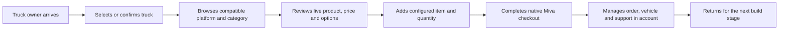
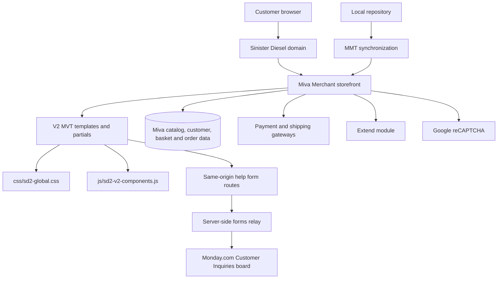
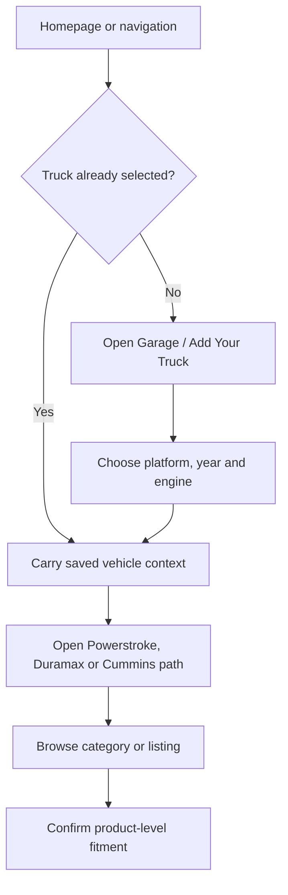
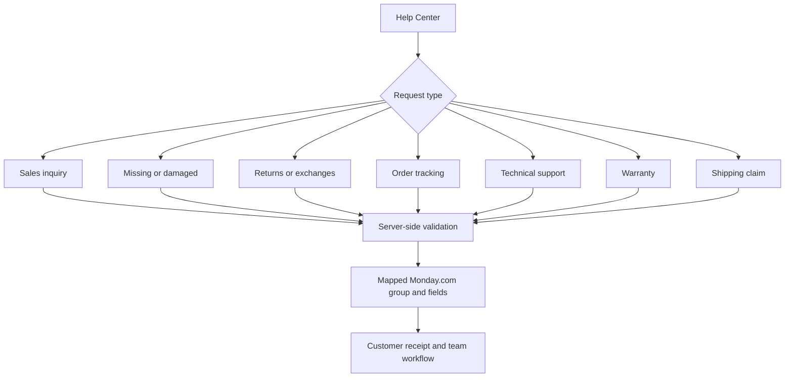
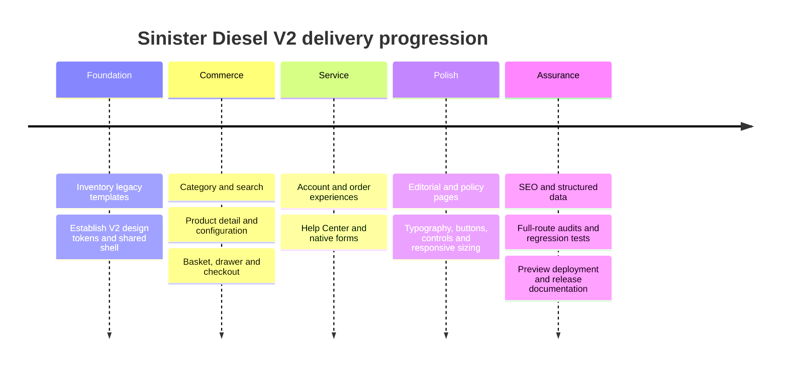

# SINISTER DIESEL V2

## Website, Commerce, and Operations Handbook

> **Document status:** Release-candidate operating handbook
>
> **Storefront:** Sinister Diesel V2 (`Revamp_v2`)
>
> **Commerce platform:** Miva Merchant
>
> **Prepared:** July 21, 2026
>
> **Canonical file:** `docs/SINISTER-DIESEL-V2-WEBSITE-HANDBOOK.md`

---

### Release snapshot

| Area | State | What that means |
|---|---|---|
| V2 implementation | **Complete** | The principal storefront, catalog, product, cart, checkout, account, help, and editorial page families are implemented in the preview branch. |
| Automated regression | **Passing** | The repository's storefront checks pass at the time this handbook was prepared. |
| Miva synchronization | **Clean** | The last verified `mmt status` result was **No files modified**. |
| Production activation | **Owner-controlled** | `Revamp_v2` remains a preview branch until the owner explicitly makes it the production/default experience. |
| External dependencies | **Action required** | Extend warranty configuration and production integration checks require authorized external owners. |
| Post-launch measurement | **Not yet measurable** | Real-user Core Web Vitals and conversion impact require production traffic. |

> [!IMPORTANT]
> **This document does not claim that V2 is already the production storefront.** It records the release-candidate state of the `Revamp_v2` preview, the evidence supporting publication, and the owner-controlled steps that remain.

### Status language used in this handbook

| Label | Definition |
|---|---|
| **Verified** | Directly confirmed by source inspection, automated tests, MMT state, or rendered preview review. |
| **Implemented** | Present in the V2 code or Miva preview, but may still require owner-controlled launch validation. |
| **External dependency** | Cannot be completed from storefront code alone. |
| **Post-launch** | Requires production traffic, real devices, or operational data. |
| **Historical** | Describes an earlier project phase and is not the current release position. |

---

## Executive Summary

Sinister Diesel V2 is a comprehensive modernization of the company's Miva Merchant storefront. It preserves Miva's commerce engine—catalog, pricing, attributes, basket, checkout, customer accounts, orders, URLs, payment gateways, and administrative workflows—while replacing the customer-facing experience with a coherent, fitment-first design system.

The result is not a detached marketing mock-up. It is a working commerce presentation built around live Miva data and the store's real operational paths. Customers can move from truck selection to compatible products, configure product options, manage quantities, use the basket and cart drawer, proceed through checkout, view account and order information, and contact the correct internal team through native forms.

The V2 work addressed problems that became visible only when the entire site was treated as one system: inconsistent typography, mismatched buttons and fields, oversized or undersized controls, navigation overflow, product-list pagination, hidden products that still rendered, configurable products showing misleading zero-dollar calls to action, cart quantity behavior, checkout state styling, account pages that looked disconnected from the storefront, editorial layouts, forms, SEO metadata, mobile behavior, and third-party integration boundaries.

### What is better now

- **One visual language:** Oswald display type, Inter body type, IBM Plex Mono technical labels, shared color/spacing/radius/shadow tokens, and repeatable component states.
- **Fitment-first shopping:** garage context follows the customer through navigation, product discovery, product detail, cart, and account experiences.
- **Clearer commerce actions:** consistent primary/secondary buttons, option selection, quantity controls, price hierarchy, cart actions, and checkout progression.
- **Stronger catalog navigation:** platform mega menus, category summaries, filters, compact pagination, vehicle fitment control, and product cards that scale across product counts.
- **A cohesive customer area:** dashboard, orders, addresses, payment, subscriptions, wish lists, rewards, returns, settings, password, and garage use the V2 shell.
- **Native support intake:** help forms post through a server-side relay to Monday.com rather than exposing integration credentials in the browser.
- **Commerce SEO foundation:** canonical metadata, page-specific titles and descriptions, structured data, and `noindex,follow` treatment for private or transactional routes.
- **Safer release operations:** source-level regression checks, MMT preview deployment, explicit external-dependency tracking, and a documented rollback path.

### Current decision

The storefront is at a **release-candidate / owner-validation** stage. Core V2 presentation and commerce behavior are implemented and regression-tested. Publication should proceed only after the release checklist in this handbook is completed, especially:

1. preserve a recoverable source-control release point;
2. perform the owner-authorized final checkout without using real customer funds accidentally;
3. validate every production form route and its Monday.com destination;
4. resolve or explicitly accept the Extend warranty configuration dependency;
5. complete final cross-browser and physical-device smoke testing; and
6. activate the preview branch through Miva's owner-controlled publishing workflow.

---

## Company and Brand Context

Sinister Diesel serves diesel-truck owners who expect parts to fit, perform, and arrive with clear support behind them. The primary vehicle platforms reflected throughout V2 are:

| Platform | Storefront language | Customer intent |
|---|---|---|
| Ford | Powerstroke | Find performance, cooling, fuel, intake, exhaust, and support parts by generation. |
| General Motors | Duramax | Shop the correct engine platform and narrow products using vehicle context. |
| Dodge / Ram | Cummins | Discover compatible upgrades and supporting components without losing truck context. |

The brand position expressed by V2 is technical, direct, and performance-led. The interface uses navy and electric blue as the primary system colors, restrained gold for trust and verification moments, large condensed display typography for authority, and quieter body typography for specification-heavy content.

### Brand principles translated into interface behavior

| Brand principle | Interface expression |
|---|---|
| Performance you control | Build paths begin with the customer's truck rather than a generic product wall. |
| Technical confidence | Fitment, SKU, inventory, price, attributes, shipping, and support information have clear hierarchy. |
| Human support | Help Center routes and native forms identify the type of request before it reaches the team. |
| American diesel culture | Platform imagery and direct, industrial typography reinforce the company's market without turning the store into a decorative concept site. |
| Trust through clarity | Prices, selections, quantities, shipping choices, payment steps, and order summaries remain visible and understandable. |

### What V2 intentionally did not change

V2 did not replace the underlying Miva Merchant business system. It did not invent a separate catalog, create an alternate order database, or bypass established checkout/payment rules. It is a modernization of presentation, navigation, component behavior, metadata, and customer guidance around the existing commerce platform.

---

## Website Mission and Business Value

### Mission

The website's mission is to help a diesel owner reach the correct part, understand why it fits, configure it correctly, purchase it confidently, and get support without unnecessary friction.

### Business value chain



### Expected commercial effects

The following are product hypotheses, not claimed production results:

- Fitment continuity should reduce the number of customers who reach an incompatible product.
- Clear option and quantity controls should reduce configuration mistakes.
- Stronger catalog hierarchy should improve discovery on large category pages.
- Consistent commerce states should reduce hesitation between product detail, basket, and checkout.
- A unified account area should improve post-purchase self-service.
- Better form routing should reduce manual triage and lost inquiries.
- Page-level SEO and structured data should make indexable catalog content easier for search engines to interpret.

These effects must be measured after launch using analytics, Search Console, Core Web Vitals, support-volume trends, form-routing success, conversion rate, and return reasons.

---

## Technical Architecture

### System overview



### Architectural layers

| Layer | Responsibility | Canonical location |
|---|---|---|
| Commerce engine | Products, categories, pricing, attributes, inventory, baskets, customers, orders, payments, shipping | Miva Merchant |
| Page templates | Route-level composition and Miva data bindings | `templates/*.mvt` |
| Shared partials | Reusable PDP, cart, checkout, account, fitment, and content components | `partials/*.mvt`, selected `templates/sd2-v2-*.mvt` |
| Design system | Tokens, typography, responsive layout, controls, cards, motion, and presentation | `css/sd2-global.css` |
| Interaction layer | Menus, drawers, garage controls, product controls, pagination, accordions, and delegated events | `js/sd2-v2-components.js` |
| Help form relay | Validation and server-side Monday.com mapping | `integrations/forms-sync/` and deployed forms service |
| SEO layer | Dynamic titles, descriptions, canonicals, robots policy, and JSON-LD | global head and commerce templates |
| Release synchronization | Tracks and pushes intended Miva theme changes | `.mmt/` metadata and MMT CLI |
| Regression evidence | Guards high-risk storefront and commerce behavior | `tests/*.test.js` |

### Why the architecture is appropriate

Miva pages are server-rendered and data-driven. A single-page application rewrite would have introduced unnecessary catalog, checkout, session, and payment risk. V2 therefore uses Miva-native templates plus dependency-light CSS and JavaScript. This keeps the critical commerce path close to the platform that owns the data while still delivering a bespoke branded experience.

### Design system foundation

The global stylesheet is the visual source of truth. Important tokens include:

| Token family | Examples | Purpose |
|---|---|---|
| Brand | `--sd2-blue`, `--sd2-blue-mid`, `--sd2-gold` | Primary actions, navigation accents, verification cues. |
| Surfaces | `--sd2-bg`, `--sd2-bg-white`, `--sd2-bg-subtle` | Page, card, and quiet-control backgrounds. |
| Text | `--sd2-text`, `--sd2-text-mid`, `--sd2-text-muted` | Predictable hierarchy and contrast. |
| Radius | `--sd2-r-sm`, `--sd2-r`, `--sd2-r-lg` | Consistent controls, cards, and major sections. |
| Shadows | `--sd2-shadow-sm`, `--sd2-shadow-md`, `--sd2-shadow-xl` | Depth without excessive visual noise. |
| Typography | `--sd2-font-display`, `--sd2-font-body`, `--sd2-font-mono` | Oswald, Inter, and IBM Plex Mono roles. |
| Type scale | `--sd2-text-xs` through `--sd2-text-4xl` | Repeatable responsive text hierarchy. |
| Layout | `--sd2-max`, `--sd2-max-narrow`, `--sd2-gutter` | Aligned content widths and page gutters. |
| Motion | duration and easing tokens | Restrained interaction feedback with reduced-motion support. |

### Template and page-family map

| Experience | Representative implementation | Primary responsibility |
|---|---|---|
| Global shell | global header, footer, mega menu, search, garage, cart drawer | Persistent navigation and store context. |
| Homepage | V2 storefront template and shared story/commerce sections | Brand promise, platform entry, fitment CTA, product discovery. |
| Category landing | `ctgyv2`, `ctgyengv2`, `ctgylistv2` families | Platform narrative, category paths, live catalog summary. |
| Product listing | category listing templates and V2 product cards | Filters, sorting, pagination, fitment, product actions. |
| Search | V2 search templates and search-result partials | Product discovery, suggestions, empty states. |
| Product detail | product display template plus `partials/sd2-v2-product-*` | Media, configuration, price, fitment, quantity, cart, FAQs. |
| Basket and drawer | `baskv2.mvt`, basket template, `global-minibasket.mvt` | Line-item review, quantity changes, removal, subtotal, checkout. |
| Checkout | `ocstv2.mvt` and native Miva checkout screens/partials | Information, shipping, payment, review, order submission. |
| Account | `account-dashboard-v2.mvt` and account partials/templates | Orders, addresses, payment, subscriptions, wish lists, returns, garage. |
| Help Center | help hub and native help templates | Route requests by problem type and submit to server-side relay. |
| Editorial/policy | blog, reviews, policies, notices, dealer, military, rewards, sitemap | Trust, education, compliance, programs, and support content. |

> [!NOTE]
> Older files such as `V2_STRUCTURE.md`, `V2_REVAMP_REPORT.md`, and portions of `DOCUMENTATION.md` describe the early V2 build as inactive or not started. Those statements are retained as historical project evidence. They must not override the current verified `Revamp_v2` preview state.

---

## Customer Journeys

### 1. Truck-first discovery



The garage is not only a header label. It supplies a persistent mental model: the store is helping the customer build around a known truck. The interface still requires customers to confirm final product fitment because catalog data and product-specific constraints remain authoritative.

### 2. Catalog and product discovery

The customer can arrive through a platform mega menu, a category landing, internal search, a promotional/editorial link, or an external search result. V2 keeps the following elements aligned:

- platform and category context;
- product count and listing controls;
- brand, price, fitment, sort, and view options;
- compact pagination rather than an unbounded row of page numbers;
- consistent product imagery and title hierarchy;
- live price and product configuration behavior;
- `Choose options` for configurable items that cannot truthfully be purchased at a base state.

### 3. Product configuration and add to cart


Key safeguards include a normalized quantity stepper, clear selected/unselected attribute styling, price hierarchy, availability and shipping information, and a cart drawer that reflects the actual line item and selected options.

### 4. Checkout

The checkout remains Miva-native and follows the platform's information, shipping, payment, review, and submission responsibilities. V2 supplies a consistent shell, step hierarchy, method cards, form-control styling, order manifest, totals, and responsive layout. It does not circumvent payment-gateway validation.

### 5. Account and post-purchase service

Authenticated customers can navigate a common V2 account shell for:

- dashboard and account summary;
- order history and order detail;
- addresses and payment methods;
- subscriptions and wish lists;
- rewards and returns;
- settings and password;
- saved vehicles / garage.

Order cards, tracking actions, reorder actions, saved vehicles, wish-list items, tables, pagination, fields, and buttons were brought into the same visual system as the storefront.

### 6. Help and inquiry routing



The browser submits to a same-origin application path. The server-side service validates the payload and creates the Monday.com item using credentials that are not shipped to the customer.

---

## Integrations and External Services

| Integration | Role | Current position | Ownership boundary |
|---|---|---|---|
| Miva Merchant | Commerce source of truth | Implemented and previewed | Store owner / Miva administrator |
| MMT | Theme synchronization and preview deployment | Last verified clean | Development/release owner |
| Monday.com | Customer inquiry work management | Server-side mapping implemented; production workflow must be smoke-tested | Customer service / Monday administrator |
| Forms relay | Validates help payloads and calls Monday.com | Deployed service previously health-checked; validate at launch | Application/server owner |
| Google reCAPTCHA | Bot protection for applicable forms | Credentials were verified in Miva; verify rendered production actions | Miva / Google administrator |
| Extend | Warranty or protection integration | External configuration dependency; vendor request observed returning 404 | Extend merchant owner / Miva module administrator |
| Payment gateways | Card and alternate payment processing | Native Miva path retained | Finance / Miva administrator |
| Shipping providers | Rates and shipping method selection | Native Miva path retained | Operations / Miva administrator |
| Search and analytics | Discovery and measurement | SEO foundation implemented; production measurement remains | Marketing / analytics owner |

### Integration safety rules

1. Credentials belong in server or platform-managed configuration, never in templates, documentation, screenshots, tests, or client-side JavaScript.
2. A health check proves that a service is running; it does not prove that every external workflow is correctly routed.
3. Every help workflow needs one controlled production submission after DNS/proxy publication.
4. A browser `GET` to a POST-only form endpoint may show “Not Found”; that is not evidence that the POST integration is broken.
5. Payment verification must use an owner-authorized test method or controlled transaction and must never charge an uninvolved customer.
6. Extend failures must be corrected in the merchant/vendor configuration; hiding the error with CSS would not repair the integration.

### Forms relay operating model

The repository's `integrations/forms-sync/` package documents native routes for sales, missing/damaged parts, returns/exchanges, order tracking, technical support, warranty, and shipping claims. Its tests use a fake provider and do not create real Monday.com items. Production calls must originate from the deployed server-side service and use configuration supplied through the service environment.

---

## Problems Tackled and Resolutions

The matrix below distinguishes visible symptoms from root causes. This matters because many “styling” defects were actually template-state, catalog-data, or integration problems.

| Area | Symptom | Root cause | Resolution | Business impact |
|---|---|---|---|---|
| Typography | Pages looked inconsistent or unfinished | Mixed inherited sizes, weights, colors, and font roles | Centralized Oswald/Inter/mono roles and a shared type scale | Stronger hierarchy and brand consistency |
| Buttons | Blank, oversized, clipped, or mismatched actions | Broad selectors, inconsistent markup, inherited styles | Normalized button families, sizes, states, text color, and high-risk page overrides | Clearer calls to action |
| Fields | Native-looking selects, inputs, radio buttons, and outlines | Browser defaults and template-specific rules | Shared control styling, focus states, spacing, and responsive sizing | More trustworthy forms and checkout |
| Product options | “No Thanks” and option buttons appeared disabled or unreadable | Low-contrast and conflicting option selectors | Rebuilt selected/unselected states with predictable contrast | Fewer configuration errors |
| Quantity | Cart/product quantities could not be changed reliably | Control markup and event/state handling diverged | Normalized stepper behavior and update path | Restored core commerce control |
| Cart drawer | Line items lacked quantity controls and visual hierarchy | Drawer-specific rendering and spacing gaps | Repaired line-item layout, selected options, subtotal, and route to basket | Faster cart review |
| Basket | Quantity input and update action looked like unrelated native controls | Missing component-level sizing and state rules | Unified minus/input/plus/update group | Clearer basket editing |
| Mega menu | Desktop menu sizing, image, columns, and support rail felt unstable | Viewport assumptions and competing shell rules | Rebalanced grid, navigation state, imagery, and responsive behavior | Better platform discovery |
| Pagination | Ford listing displayed dozens of page buttons | All pages rendered without compact-window logic | Added compact pagination with current-page context | Less overflow and cognitive load |
| Hidden products | Products marked hidden still occupied listing space | Card layout rule overrode the HTML `hidden` behavior | Added an explicit hidden-product rule | Prevented stale/invalid listing cards |
| Configurable pricing | Two coolant-hose products advertised `$0.00` with direct add | Catalog base price depends on attributes | Listing now uses `Choose options`; catalog owner must correct base-data presentation | Avoids misleading purchase action |
| Product cards | Image, title, SKU, price, and actions varied by listing | Multiple inherited presentation paths | Consolidated V2 product-card structure and responsive sizing | More scannable catalog |
| PDP | Fitment, FAQ, sticky buy bar, attributes, and media felt disconnected | Independent partials lacked a shared composition layer | Unified product hero, summary, controls, tabs, FAQs, and sticky action | More confident product evaluation |
| FAQ link | A fragment could resolve against the wrong base path | Bare fragment URL behavior | Bound the jump to the live product URL plus `#faq` | Reliable in-page navigation |
| Checkout offer | Upsell page had low-contrast savings and unbalanced panels | Overly light text and weak layout constraints | Rebalanced hero, offer panel, savings hierarchy, and buttons | More legible optional offer |
| Checkout methods | Radio/select state and payment controls looked native or ambiguous | Browser controls and Miva markup were not normalized | Styled method cards, selection indicators, fields, and step states | Greater checkout clarity |
| Account | Customer pages looked separate from the V2 site | Legacy tables, native controls, and inconsistent shells | Unified account header, navigation, cards, tables, pagination, and actions | Stronger post-purchase continuity |
| Order detail | Track/reorder buttons clipped or floated outside cards | Width and alignment assumptions | Normalized action widths, card flow, and mobile stacking | Usable order self-service |
| Wish lists | Item layout and buttons were inconsistent | Legacy list markup and inherited action rules | Rebuilt V2 list cards and actions | Clearer saved-product workflow |
| Editorial pages | Sale restrictions, policies, dealer, military, rewards, blog, reviews, notices, and sitemap varied widely | Legacy content had page-specific structures and embeds | Applied the V2 shell while preserving content purpose | Consistent trust and education layer |
| Help forms | Email receipt could succeed while Monday.com item was absent | Submission and work-management delivery are separate outcomes | Routed creation through server-side forms API and verified API item creation | Reduced lost inquiries |
| Form route testing | Opening the endpoint URL displayed “Not Found” | Browser used GET against a POST-only endpoint | Documented correct POST/health-check verification | Avoids false diagnosis |
| SEO | Public and transactional pages lacked one coherent indexing policy | Metadata evolved page by page | Added dynamic metadata, canonicals, structured data, and private-route `noindex,follow` | Stronger crawl and index hygiene |
| Responsive layout | Controls, cards, and page families overflowed or felt oversized | Desktop-first dimensions and inconsistent breakpoints | Audited desktop/mobile routes and tightened responsive behavior | Better usability across devices |
| Motion | Premium movement risked becoming distracting | Component effects were not centrally constrained | Lightweight dependency-free motion plus reduced-motion fallbacks | Polish without blocking accessibility |
| Text selection | Default selection became unreadable over blue sections | Browser selection colors conflicted with the palette | Technical Blue interaction treatment has been designed; implementation remains tracked | Consistent branded interaction when completed |
| Extend | Vendor endpoint returned 404 | External merchant/module configuration | Escalate to authorized Extend/Miva owner; do not mask with CSS | Prevents false protection promises |

---

## Why the Project Took Time

This project took time because it was not a single homepage redesign. It was a storefront-wide commerce migration with dynamic data, many route families, authenticated states, integrations, and release safety requirements.

### Delivery timeline by problem class



### Why defects surfaced in waves

1. **Miva renders many states from shared templates.** A CSS rule that fixes one button can unintentionally alter an upsell, wish list, order action, or payment control.
2. **Catalog data changes the interface.** Products may be simple, configurable, discounted, hidden, unavailable, or dependent on vehicle context.
3. **Authenticated pages are different applications in practice.** Account, order history, order detail, addresses, returns, wish lists, and garage each expose distinct Miva markup.
4. **Checkout cannot be judged from a static screenshot.** Shipping choices, payment fields, totals, offers, gateways, and responsive states change with the session.
5. **Third-party success is multi-stage.** A customer receipt, a server response, and a Monday.com item are separate results; all must be validated.
6. **Visual polish is cumulative.** Typography, image scale, spacing, borders, contrast, focus, hover, selection, and motion must agree across dozens of page families.
7. **Release safety required preview-first work.** The team preserved established commerce behavior and used the Miva preview branch instead of making uncontrolled production replacements.

### Historical documents versus current reality

Early reports correctly stated that V2 templates were inactive and browser QA had not begun. Later phases activated the design on `Revamp_v2`, audited rendered pages, repaired live preview defects, and added automated regression coverage. This handbook is the current release reference; older status reports remain valuable for understanding how the work evolved but are not a launch checklist.

---

## Quality Assurance

### Test strategy

Quality assurance combines four evidence types:

| Evidence | What it proves | What it does not prove |
|---|---|---|
| Static/source tests | Required templates, selectors, metadata, links, and protections exist | Browser layout and external service availability |
| MMT status | Local Miva-managed files match the synchronized preview state | Production branch activation or external integrations |
| Rendered browser review | Layout, typography, controls, responsive behavior, and dynamic page states render as expected | Every physical browser/device and every catalog permutation |
| Controlled workflow tests | Forms, cart, checkout, account, and integrations reach expected states | Long-term reliability under production traffic |

### Automated regression coverage

At handbook preparation, the repository contains checks for:

- shipping policy presentation;
- button and link integrity;
- commerce controls;
- commerce-flow repairs;
- commerce SEO;
- editorial pages;
- encoding integrity;
- final-site audit rules;
- installation instructions;
- premium presentation;
- release-candidate requirements;
- storefront readiness; and
- this handbook's required sections, release language, and secret safety.

### Rendered route coverage

The preview audit covered representative desktop and mobile experiences across:

- homepage and global shell;
- Powerstroke, Duramax, and Cummins platform/category pages;
- high-volume product listings, leaf categories, search, new, clearance, scratch-and-dent, and brand routes;
- representative PDP configuration and FAQ behavior;
- cart drawer, basket, special offer, information, shipping, and payment views;
- login/authenticated account, orders, order detail, addresses, wish lists, returns, settings, and garage;
- Help Center and inquiry pages;
- policy, dealer, military, rewards, blog, customer reviews, race-parts notice, sitemap, Sinister notice, sponsor/application, and 404 content.

An earlier automated visual sweep recorded 52 routes. It was followed by additional focused audits and fixes, so it is evidence of breadth rather than a claim that its earliest findings still describe the current preview.

### QA rules before sign-off

- Never treat a screenshot as proof that a form or purchase action succeeded.
- Never create a real charge during automated verification.
- Verify desktop and mobile widths after any global CSS change.
- Re-test account and checkout after broad button, input, select, table, or card changes.
- Re-test configurable and simple products separately.
- Confirm visible focus and reduced-motion behavior.
- Check console/network failures and distinguish application defects from blocked third-party services.
- Run MMT status before and after deployment.

---

## Current Release Position

### Verified state on July 21, 2026

| Dimension | Position | Evidence |
|---|---|---|
| Storefront branch | `Revamp_v2` preview | Rendered preview sessions and MMT workflow |
| Core design | Implemented | Shared V2 CSS, templates, partials, and browser review |
| Commerce presentation | Implemented | PDP, basket, checkout, account, category, and regression checks |
| Automated tests | Passing at latest verification | Node test suite |
| MMT working state | Clean | `mmt status` → **No files modified** |
| Git release state | Consolidation required | Many synchronized/deployed source files remain outside one clean release commit |
| Production/default branch | Not activated by this handbook | Owner-controlled Miva publication remains |
| Extend | Not release-verified | External configuration returns a vendor 404 |
| Production forms | Final smoke test required | Server-side relay exists; verify every production workflow after publication |
| Real-user performance | Unknown until traffic | Post-launch RUM/Core Web Vitals |

### Release-readiness interpretation

The preview is suitable for final owner validation. It should not be represented as “finished forever”: commerce sites require ongoing catalog, browser, integration, SEO, accessibility, and performance maintenance. The immediate codebase is substantially more coherent and testable than the legacy presentation, but publication still needs operational ownership.

---

## Remaining Work

| Status | Owner | Release impact | Next action |
|---|---|---|---|
| **Required** | Development / release owner | A clean, recoverable release reference is needed before production | Review the dirty Git tree, include only intended V2 source, create a release commit/tag, and archive the exact MMT state. |
| **Required** | Store owner / Miva administrator | Production cannot begin without explicit activation | Complete the checklist below and publish `Revamp_v2` through the approved Miva branch workflow. |
| **Required** | QA + store owner | Checkout success is not fully proven until an authorized end-to-end transaction is completed | Use an approved test gateway/card or controlled transaction, confirm order creation, email, payment state, and cancellation/refund procedure. |
| **Required** | Customer service + forms owner | A form can look successful while routing to the wrong board/group | Submit one controlled request for every production help workflow and confirm the Monday.com item and customer receipt. |
| **External dependency** | Extend merchant owner / Miva administrator | Warranty/protection functionality may fail or misrepresent availability | Obtain Extend access or vendor support and correct the configured store/API relationship that returns 404. |
| **Catalog ownership** | Merchandising / Miva catalog owner | Two configurable coolant-hose PDPs can display a zero base price before options | Define truthful base/variant pricing behavior in Miva; keep listing CTA as `Choose options` until corrected. |
| **Recommended** | QA | Browser-specific issues may remain outside Chrome preview review | Smoke-test current Chrome, Safari, Firefox, and Edge plus iOS Safari and Android Chrome. |
| **Recommended** | Accessibility owner | Automated checks do not replace assistive-technology review | Perform keyboard-only, zoom, contrast, form-label, error, and screen-reader smoke tests. |
| **Approved design, not implemented** | Frontend owner | No release blocker, but leaves an inconsistent text-selection/microinteraction detail | Implement and verify the Technical Blue interaction specification. |
| **Post-launch** | Marketing / analytics | Search and performance gains cannot be measured in preview | Capture baseline and 30-day Search Console, analytics, conversion, form, error, and Core Web Vitals data. |

### Explicitly not a storefront-code fix

- Extend account or merchant authorization.
- Vendor-side API configuration.
- Miva production branch publication rights.
- Real payment-gateway credentials.
- Catalog pricing decisions.
- DNS, CDN, or proxy ownership outside the repository.
- Long-term traffic and conversion measurement.

---

## Publication and Rollback Runbook

### A. Pre-publication gate

- [ ] Confirm the exact Miva preview is `Revamp_v2`.
- [ ] Run the complete regression suite and retain the output.
- [ ] Run `mmt status`; expected result: `No files modified`.
- [ ] Review Git status and create a scoped release commit/tag containing the intended deployed source.
- [ ] Confirm no secrets, preview cookies, customer data, or private keys are in source or documentation.
- [ ] Confirm reCAPTCHA renders and validates on applicable forms.
- [ ] Confirm all seven help workflows create the expected Monday.com items.
- [ ] Complete authorized cart, shipping, payment, and order smoke testing.
- [ ] Decide whether Extend is fixed or explicitly accepted as a launch exception.
- [ ] Confirm configurable zero-base-price catalog records have an owner and mitigation.
- [ ] Smoke-test desktop and physical mobile devices.
- [ ] Capture screenshots of the current production experience and export/retain its branch/template assignments.

### B. Controlled publication

1. Announce the release window and identify the release owner, Miva administrator, QA owner, and rollback decision-maker.
2. Freeze unrelated template edits during the window.
3. Confirm the preview branch and release commit match the signed-off build.
4. Use Miva's branch/template publication controls to promote the approved V2 experience.
5. Do not use an unreviewed bulk overwrite or delete legacy templates.
6. Immediately verify homepage, navigation, search, one category, one simple PDP, one configurable PDP, cart, checkout entry, login, account, Help Center, and a form submission.
7. Watch application logs, form routing, payment/shipping errors, and customer-service reports.

### C. First-hour smoke test

| Path | Pass condition |
|---|---|
| Homepage | Header, hero, truck CTA, platform navigation, imagery, and footer render. |
| Mega menu | Each platform opens, keyboard focus is usable, links reach valid destinations. |
| Search/category | Results, filters, sort, pagination, images, prices, and product links work. |
| PDP | Fitment, options, quantity, price, add-to-cart, FAQ, and sticky action work. |
| Cart/basket | Correct items/options/quantities/totals; increment, decrement, update, remove work. |
| Checkout | Shipping and payment choices load; totals stay consistent; no console-blocking failure. |
| Account | Login and representative dashboard/order/garage routes render. |
| Help | One controlled form reaches receipt and correct Monday.com destination. |
| SEO | Title, canonical, robots intent, and structured data match the route type. |

### D. Rollback triggers

Rollback promptly if any of the following occurs and cannot be corrected safely inside the window:

- customers cannot add normal products to the basket;
- quantities, selected attributes, prices, totals, or discounts are wrong;
- checkout or primary payment method cannot proceed;
- authenticated customers cannot access core account/order information;
- global navigation blocks shopping on a major device class;
- production forms lose or misroute requests;
- a security, privacy, or credential exposure is discovered.

### E. Rollback procedure

1. Stop additional V2 changes and record the time and observed failure.
2. In Miva, restore the previously documented production branch/template assignments.
3. Re-run the minimum smoke paths on the restored experience.
4. Confirm forms, basket, checkout, account, and payment availability.
5. Preserve logs, screenshots, route/session details, and the release commit for diagnosis.
6. Repair in preview, add a regression test for the failure, and schedule a new controlled window.

> [!WARNING]
> MMT synchronization is not a substitute for a documented Miva branch rollback. The production administrator must know which branch/template assignments were active before publication.

---

## Maintenance and Ownership

### Ownership model

| Domain | Primary owner | Operating responsibility |
|---|---|---|
| Storefront design system | Frontend development | Tokens, shared components, responsive layout, accessibility states. |
| Miva templates and releases | Miva administrator + release owner | Preview assignment, data binding, publication, rollback. |
| Catalog and pricing | Merchandising | Products, categories, images, attributes, base/variant prices, visibility. |
| Checkout and payments | Finance + Miva administrator | Gateways, test methods, fraud controls, order/payment reconciliation. |
| Shipping | Operations | Methods, rates, delivery messaging, policy alignment. |
| Customer accounts | Customer service + Miva administrator | Account workflows, returns, order support, customer data handling. |
| Help forms and Monday.com | Customer service + application owner | Route mapping, board/group ownership, automations, monitoring. |
| SEO and content | Marketing | Metadata quality, indexation, schema, editorial updates, Search Console. |
| Analytics/performance | Marketing + development | Measurement, Core Web Vitals, funnel monitoring, regressions. |
| External vendors | Designated account owner | Extend, Google, payment, shipping, email, and DNS/provider access. |

### Change rules

1. Prefer shared tokens and components over page-specific duplication.
2. Keep Miva data and action URLs authoritative; do not replace them with guessed hardcoded values.
3. Add or update a regression test for every defect that can be expressed in source.
4. Test a global CSS change on storefront, PDP, cart, checkout, account, and editorial representatives.
5. Keep credentials and customer data out of the repository.
6. Deploy to preview first; verify the rendered result before production.
7. Record external dependencies rather than disguising them with visual workarounds.
8. Update this handbook when ownership, routes, integrations, or release procedures change.

### Recommended operating cadence

| Cadence | Checks |
|---|---|
| Every release | Tests, MMT status, Git scope, desktop/mobile smoke, commerce path, form path, rollback readiness. |
| Weekly | Broken navigation, form failures, Monday routing, checkout errors, search/indexing anomalies. |
| Monthly | Core Web Vitals, conversion/funnel, top exits, zero-result searches, catalog image/price quality. |
| Quarterly | Accessibility review, dependency/vendor audit, stale content, structured data, account/checkout regression. |
| Annually | Recovery exercise, credential/access review, data retention, design-system and browser support review. |

---

## 30 / 60 / 90-Day Roadmap

### First 30 days — stabilize and measure

- Complete publication using the runbook.
- Monitor checkout, payment, shipping, form, and JavaScript errors daily during the first week.
- Validate Monday.com routing for every inquiry type.
- Resolve the Extend configuration or formally remove/defer the affected offer with stakeholder approval.
- Correct configurable base-price records.
- Establish Search Console, analytics, conversion, and Core Web Vitals baselines.
- Implement the approved Technical Blue interaction layer if it was not included before launch.

### Days 31–60 — optimize the highest-impact friction

- Review zero-result searches and high-exit category/PDP paths.
- Compare truck-selected versus truck-unselected conversion behavior.
- Review product option errors, support reasons, and returns for fitment/configuration signals.
- Improve catalog photography or metadata where product cards remain inconsistent.
- Address real-user performance bottlenecks using measured LCP, INP, and CLS—not assumptions.
- Complete a structured accessibility pass and remediate priority findings.

### Days 61–90 — institutionalize the platform

- Create a recurring release checklist in the team's operational system.
- Assign named backups for Miva, forms server, Monday.com, DNS, reCAPTCHA, payments, shipping, and Extend.
- Add regression coverage for the top production incidents or support drivers.
- Review organic landing-page performance and structured-data coverage.
- Decide which editorial or category templates need content—not design—improvements.
- Run a documented rollback/recovery exercise.

---

## File Map and Command Reference

### Canonical source map

| Path | Purpose |
|---|---|
| `css/sd2-global.css` | Global V2 design system, typography, responsive layout, components, and page refinements. |
| `js/sd2-v2-components.js` | Shared storefront interactions and delegated behavior. |
| `templates/` | Miva route templates, global components, page content, and commerce bindings. |
| `partials/` | Reusable PDP, checkout, account, and related component structures. |
| `integrations/forms-sync/` | Native help-form validation/mapping service and safe tests. |
| `tests/` | Storefront regression suite. |
| `docs/superpowers/specs/` | Approved designs and decision records. |
| `docs/superpowers/plans/` | Implementation and audit plans. |
| `scratch/visual-audit/` | Point-in-time visual-audit artifacts; useful evidence, not current truth by itself. |
| `.mmt/` | Tool-managed Miva synchronization metadata. |
| `DOCUMENTATION.md` | Earlier architecture/project documentation; some status statements are historical. |
| `V2_STRUCTURE.md` | Detailed early V2 inventory and milestone record. |
| `V2_REVAMP_REPORT.md` | Early revamp report and rationale. |
| `docs/SINISTER-DIESEL-V2-WEBSITE-HANDBOOK.md` | Current canonical operating and release handbook. |

### Local verification commands (PowerShell)

```powershell
Set-Location "C:\Users\admin\OneDrive\Desktop\Work\sinister-revamp"

# Run every storefront regression test.
$failed = @()
Get-ChildItem .\tests\*.test.js | Sort-Object Name | ForEach-Object {
    node $_.FullName
    if ($LASTEXITCODE -ne 0) { $failed += $_.Name }
}
if ($failed.Count) { throw "Failed tests: $($failed -join ', ')" }

# Confirm synchronized Miva source state.
mmt status

# Inspect Git release scope without changing files.
git status --short
git log -10 --oneline
```

### MMT preview deployment

```powershell
# First review the exact MMT scope.
mmt status

# Push only reviewed changes to the configured preview branch.
mmt push --notes "Describe the verified V2 change"

# Expected after a successful synchronized push:
mmt status
# No files modified
```

Do not use a generic note unrelated to the actual change. Do not publish production merely because MMT is clean; production activation is a separate Miva owner action.

### Forms service health and restart (server)

```bash
cd /opt/sinister-forms-api
pm2 status
pm2 logs sinister-forms-api --lines 100
curl -i http://127.0.0.1:3100/healthz

# After an authorized, reviewed deployment only:
npm install --omit=dev
pm2 restart sinister-forms-api --update-env
pm2 save
curl -i http://127.0.0.1:3100/healthz
```

The health endpoint confirms process availability. Use a controlled POST workflow to prove Monday.com delivery; never paste service credentials into shell history, documentation, or chat.

### Release evidence to retain

- release commit and tag;
- MMT status before and after push;
- regression-test output;
- signed-off desktop/mobile screenshots;
- production smoke-test record;
- form-to-Monday routing results;
- authorized checkout/order result;
- known exceptions and their owners;
- previous production branch/template assignments;
- rollback decision and outcome if used.

---

## Appendix A — SEO and Indexing Policy

### Indexable commerce/content routes

Representative public pages should emit a useful title, meta description, canonical URL, and one intentional H1 path. Product/category data should use dynamic Miva values with safe fallbacks. Structured data must describe the real rendered entity and must not contain placeholder claims.

### Private, transactional, and internal routes

Account, login, password, wish-list management, basket, checkout, order, return workflow, internal search-result, print, feed, and similar customer-specific pages use `noindex,follow`. A canonical tag does not make a private page indexable and is not a substitute for robots policy.

### Post-launch SEO checks

- submit or confirm the production sitemap in Search Console;
- inspect representative product, category, editorial, and noindex URLs;
- monitor duplicate titles/descriptions and canonical conflicts;
- validate product, breadcrumb, organization, and other applicable schema;
- review crawl errors and soft 404s;
- track organic landing-page engagement and conversion;
- update metadata when catalog/content intent changes.

---

## Appendix B — Accessibility and Interaction Standards

- All interactive controls need a visible keyboard focus state.
- Do not remove native focus unless a clear `:focus-visible` replacement exists.
- Labels and error messages must remain associated with their fields.
- Selected radio, option, shipping, and payment states need more than color alone where practical.
- Buttons and links must retain meaningful text and adequate target size.
- Heading order should communicate the page structure, not merely visual size.
- Images need useful alternative text when informative and empty alternative text when decorative.
- Motion must respect `prefers-reduced-motion`.
- Text must remain readable at browser zoom and on narrow mobile widths.
- The approved Technical Blue specification defines a restrained selection, focus, link, button, autofill, scrollbar, and reduced-motion layer; it remains a tracked implementation item until verified in source and preview.

---

## Appendix C — Definition of Done

A storefront release is done when all of the following are true:

- [ ] The intended requirement is implemented in shared architecture where appropriate.
- [ ] The change has regression coverage proportional to its risk.
- [ ] All automated tests pass.
- [ ] Desktop and mobile rendered behavior is verified.
- [ ] Product, basket, checkout, account, and help implications are considered.
- [ ] MMT contains only intended changes and returns clean after push.
- [ ] Git contains a recoverable scoped release reference.
- [ ] No credentials or customer data are exposed.
- [ ] External dependencies are verified or explicitly accepted by a named owner.
- [ ] Production publication and rollback ownership are clear.
- [ ] Post-release smoke testing is complete.
- [ ] This handbook or the relevant runbook is updated if operating behavior changed.

---

## Appendix D — Glossary

| Term | Meaning |
|---|---|
| **Miva Merchant** | The commerce platform that owns catalog, basket, checkout, customer, and order behavior. |
| **MVT** | Miva template language/file used to render storefront pages and components. |
| **MMT** | The local synchronization tool used to track and push Miva theme/template changes. |
| **V2** | The Sinister Diesel visual, interaction, content, SEO, and commerce-presentation modernization. |
| **`Revamp_v2`** | The Miva preview branch used for the V2 release candidate. |
| **PDP** | Product detail page. |
| **PLP** | Product listing page. |
| **Fitment** | Whether a product is appropriate for the selected truck/engine context. |
| **Garage** | The saved/current vehicle context used by the storefront. |
| **CTA** | Call to action, such as Add to Cart or Choose Options. |
| **Canonical URL** | The preferred public URL for an indexable page. |
| **Structured data** | Machine-readable schema describing products, breadcrumbs, organization, or content. |
| **Core Web Vitals** | LCP, INP, and CLS user-experience measures collected from lab or real-user data. |
| **RUM** | Real-user monitoring from actual production sessions. |
| **Release candidate** | A build considered suitable for final owner validation but not yet declared production. |

---

### Handbook stewardship

This handbook is deliberately operational. Update it when the production branch changes, an integration owner changes, a new commerce flow is introduced, a known dependency is resolved, or the release process changes. Keep historical reports for traceability, but use this file as the current source of truth for V2 release and maintenance decisions.
