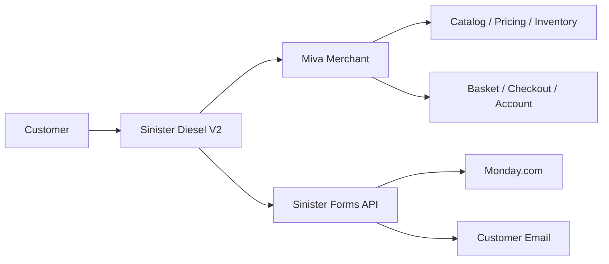

# Sinister Diesel V2 Website Handbook Implementation Plan

> **For agentic workers:** REQUIRED SUB-SKILL: Use superpowers:subagent-driven-development (recommended) or superpowers:executing-plans to implement this plan task-by-task. Steps use checkbox (`- [ ]`) syntax for tracking.

**Goal:** Produce a verified, visually structured, source-controlled handbook that explains the Sinister Diesel company website, V2 architecture, business improvements, project history, solved issues, present readiness, remaining work, launch procedure, and maintenance ownership.

**Architecture:** Build one canonical Markdown handbook from current repository, audit, test, integration, and release evidence. Protect it with a focused Node regression contract that checks required sections, diagrams, status language, commands, local references, and secret-safety; then verify all existing storefront tests and MMT state before recording the final snapshot.

**Tech Stack:** Markdown, Mermaid, Node.js assertions, PowerShell, Git, Miva Merchant Templates, Miva MMT CLI

## Global Constraints

- The canonical source is `docs/SINISTER-DIESEL-V2-WEBSITE-HANDBOOK.md`.
- Keep the document readable in raw and rendered Markdown without remote styling or proprietary fonts.
- Separate verified facts, assessments, recommendations, external dependencies, and historical statements.
- Do not expose API keys, passwords, tokens, cookies, private Monday addresses, customer records, or other secrets.
- Do not claim production publication while `Revamp_v2` remains a preview branch.
- Record clean MMT state separately from the unconsolidated Git working tree.
- Use the status terms Complete, Ready for validation, External dependency, Post-launch, and Historical consistently.
- Preserve the existing website source; this plan creates documentation and its validation contract only.

---

### Task 1: Create the handbook contract and evidence inventory

**Files:**
- Create: `tests/v2-website-handbook.test.js`
- Create: `docs/SINISTER-DIESEL-V2-WEBSITE-HANDBOOK.md`
- Read: `V2_STRUCTURE.md`
- Read: `V2_REVAMP_REPORT.md`
- Read: `DOCUMENTATION.md`
- Read: `docs/V2-vs-Legacy-Detailed.html`
- Read: `docs/superpowers/specs/*.md`
- Read: `docs/superpowers/plans/*.md`
- Read: `scratch/visual-audit/whole-site/report.json`

**Interfaces:**
- Consumes: current repository and audit evidence.
- Produces: a handbook skeleton and `tests/v2-website-handbook.test.js` contract used by every later task.

- [ ] **Step 1: Write the failing handbook contract**

Create a Node test that reads the handbook and asserts:

```js
const assert = require('node:assert/strict');
const fs = require('node:fs');
const path = require('node:path');

const root = path.resolve(__dirname, '..');
const handbookPath = path.join(root, 'docs/SINISTER-DIESEL-V2-WEBSITE-HANDBOOK.md');
assert.ok(fs.existsSync(handbookPath), 'the canonical V2 website handbook must exist');
const handbook = fs.readFileSync(handbookPath, 'utf8');

for (const heading of [
  'Executive Summary', 'Company and Brand Context', 'Website Mission and Business Value',
  'Technical Architecture', 'Customer Journeys', 'Integrations and External Services',
  'Problems Tackled and Resolutions', 'Why the Project Took Time', 'Quality Assurance',
  'Current Release Position', 'Remaining Work', 'Publication and Rollback Runbook',
  'Maintenance and Ownership', '30 / 60 / 90-Day Roadmap', 'File Map and Command Reference'
]) assert.match(handbook, new RegExp(`^## ${heading}$`, 'm'), `missing handbook section: ${heading}`);

assert.match(handbook, /```mermaid[\s\S]*?flowchart/, 'handbook must include an architecture diagram');
assert.match(handbook, /\| Status \| Owner \| Release impact \| Next action \|/, 'remaining work must assign ownership and actions');
assert.match(handbook, /Revamp_v2[\s\S]*preview/i, 'handbook must state that Revamp_v2 is a preview branch');
assert.match(handbook, /MMT[\s\S]*No files modified/i, 'handbook must record the verified MMT state');
assert.doesNotMatch(handbook, /(MONDAY_API_TOKEN|RECAPTCHA_SECRET|BEGIN (RSA|OPENSSH) PRIVATE KEY|BranchKey\s*=)/i, 'handbook must not expose secrets');
console.log('V2 website handbook structure, readiness language, and secret safety verified');
```

- [ ] **Step 2: Run the test and verify it fails**

Run: `node tests/v2-website-handbook.test.js`

Expected: FAIL because `docs/SINISTER-DIESEL-V2-WEBSITE-HANDBOOK.md` does not exist.

- [ ] **Step 3: Create the handbook skeleton**

Create the document with the exact H2 sections asserted above, a document-control block, an at-a-glance scorecard, and empty section bodies containing only evidence-source comments such as `<!-- Evidence: V2_STRUCTURE.md -->`; do not add unsupported prose.

- [ ] **Step 4: Run the contract and confirm the skeleton still fails meaningfully**

Run: `node tests/v2-website-handbook.test.js`

Expected: FAIL on the first missing architecture/status/readiness requirement rather than the file-existence assertion.

### Task 2: Author company, experience, architecture, and workflow sections

**Files:**
- Modify: `docs/SINISTER-DIESEL-V2-WEBSITE-HANDBOOK.md`
- Test: `tests/v2-website-handbook.test.js`

**Interfaces:**
- Consumes: the Task 1 skeleton and verified source/template evidence.
- Produces: leadership overview, brand context, system architecture, page inventory, design system explanation, customer journeys, and integration map.

- [ ] **Step 1: Write the executive and company narrative**

Document Sinister Diesel as a diesel-performance ecommerce company serving Powerstroke, Duramax, and Cummins owners; explain the fitment-first V2 value proposition without inventing revenue, conversion, market-share, or customer-demographic claims.

- [ ] **Step 2: Add the visual scorecard and architecture diagrams**

Include compact tables for business value and release status plus Mermaid diagrams showing:



- [ ] **Step 3: Document page families and core journeys**

Cover homepage, platform categories, leaf categories, search, PDP, Garage/fitment, mini-cart, cart, checkout, account, Help Center, editorial/policy, installation, reviews, blog, and error/empty states. State which data is Miva-native and which behavior is shared V2 CSS/JavaScript.

- [ ] **Step 4: Document integrations without secrets**

Describe MMT, forms API, Monday.com, customer email, reCAPTCHA, Extend, payment methods, analytics, reviews, video embeds, and search dependencies at the system-boundary level. Never reproduce credentials, private board addresses, preview cookies, or tokens.

- [ ] **Step 5: Run the handbook contract**

Run: `node tests/v2-website-handbook.test.js`

Expected: the structural and architecture assertions pass; remaining readiness assertions may still fail until Task 3.

### Task 3: Author history, issue matrix, readiness, and operating runbook

**Files:**
- Modify: `docs/SINISTER-DIESEL-V2-WEBSITE-HANDBOOK.md`
- Test: `tests/v2-website-handbook.test.js`

**Interfaces:**
- Consumes: Task 2 handbook content plus tests, audits, Git state, MMT state, and issue evidence.
- Produces: complete issue history, timeline, readiness statement, remaining-work ownership table, publish/rollback procedure, maintenance guide, roadmap, and appendices.

- [ ] **Step 1: Add the problem-resolution matrix**

Cover at minimum typography cascade drift, inconsistent controls, category hidden-card pagination, mobile pagination overflow, configurable `$0.00` listings, mega-menu behavior, cart quantity controls, mini-cart grouping, checkout/radio/form styling, account overflow, editorial legacy layout, sales-form API/Monday routing, SEO metadata/schema, broken legacy routes, image sizing, responsive overflow, and accessibility/focus treatment. For every row include symptom, root cause, resolution, verification, and business impact.

- [ ] **Step 2: Explain the project duration factually**

Explain Miva template breadth, dynamic catalog/account/checkout states, preview-branch verification, third-party boundaries, responsive permutations, inherited CSS cascade, preservation of native commerce behavior, iterative user review, and evidence-based regression work. Do not blame individuals or characterize iteration as failure.

- [ ] **Step 3: Add current-state and remaining-work tables**

Record MMT as clean at the captured verification time and Git as unconsolidated. Assign owners and next actions for production activation, release commit/tag, Extend endpoint configuration, configurable-product base pricing, authorized transaction validation, production forms validation, Technical Blue interactions, cross-browser/real-device checks, and post-production Core Web Vitals.

- [ ] **Step 4: Add launch, rollback, maintenance, and roadmap guidance**

Include exact safe commands for `mmt status`, `mmt push --notes`, test execution, PM2 health checks for the forms API, and non-destructive release verification. Make publication and rollback Miva-admin decisions explicit; do not invent an automated rollback command.

- [ ] **Step 5: Complete the file map and glossary**

Map `css/sd2-global.css`, `js/sd2-v2-components.js`, active Miva templates/partials, `integrations/forms-sync`, tests, specs/plans, scripts, and MMT state. Define Miva, MMT, V2, preview branch, PDP, PLP, Garage, fitment, canonical URL, structured data, and Core Web Vitals.

- [ ] **Step 6: Run the handbook contract**

Run: `node tests/v2-website-handbook.test.js`

Expected: PASS with `V2 website handbook structure, readiness language, and secret safety verified`.

### Task 4: Verify the complete handbook and release snapshot

**Files:**
- Modify: `docs/SINISTER-DIESEL-V2-WEBSITE-HANDBOOK.md` only if verification exposes an inaccurate statement.
- Test: `tests/v2-website-handbook.test.js`

**Interfaces:**
- Consumes: the complete handbook.
- Produces: a verified canonical document and current evidence record.

- [ ] **Step 1: Scan for placeholders, contradictions, and secrets**

Run:

```powershell
rg -n "TBD|TODO|FIXME|implement later|not yet started" docs\SINISTER-DIESEL-V2-WEBSITE-HANDBOOK.md
rg -n "TOKEN=|SECRET=|PASSWORD=|BranchKey=|BEGIN .*PRIVATE KEY" docs\SINISTER-DIESEL-V2-WEBSITE-HANDBOOK.md
```

Expected: no actionable placeholders or secret values.

- [ ] **Step 2: Verify local file references**

Parse every backticked repository path beginning with `css/`, `js/`, `templates/`, `partials/`, `integrations/`, `tests/`, `scripts/`, or `docs/` and assert that it exists. Correct any invalid reference.

- [ ] **Step 3: Run all documentation and storefront tests**

Run:

```powershell
$failed = @()
Get-ChildItem tests -Filter *.test.js | Sort-Object Name | ForEach-Object {
  node $_.FullName
  if ($LASTEXITCODE -ne 0) { $failed += $_.Name }
}
if ($failed.Count) { throw "Failed: $($failed -join ', ')" }
```

Expected: all test files pass with zero failures.

- [ ] **Step 4: Capture final MMT and Git state**

Run `mmt status` and `git status --short` immediately before finalizing the readiness section. Record `No files modified` for MMT only if that is the fresh output, and describe Git changes without claiming the working tree is clean.

- [ ] **Step 5: Commit the handbook and its contract**

```powershell
git add -- docs/SINISTER-DIESEL-V2-WEBSITE-HANDBOOK.md tests/v2-website-handbook.test.js docs/superpowers/plans/2026-07-21-v2-website-handbook.md
git commit -m "docs: add Sinister Diesel V2 website handbook"
```

Expected: one documentation commit containing only the handbook, validation contract, and implementation plan.
